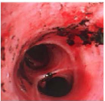
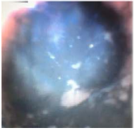
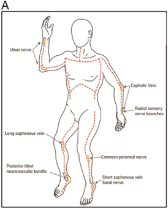
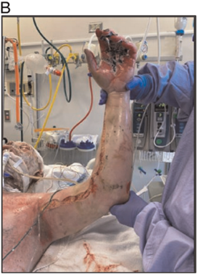
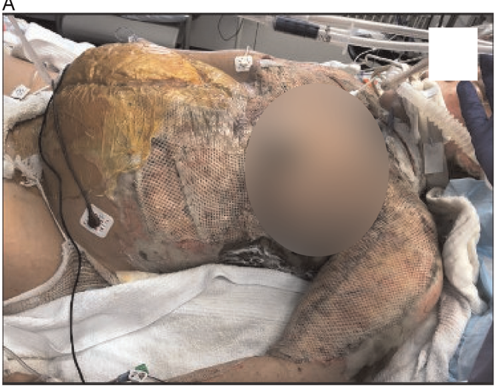
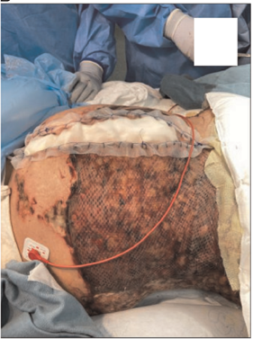

## Initial management of patients with burns and combined injuries for acute care surgeons: What you need to know

Barclay T. Stewart, MD, PhD, FACS, Mary A. Hunter, MD, Laura Johnson, MD, Dylan Jason, MD, and Saman Arbabi, MD , Seattle, Washington

## ABSTRACT:

There are nearly 700,000 adults and children with burn injuries who seek care in America each year. While most patients with major burn injuries are cared for at American Burn Association -verified burn centers, many of them present to nonburn centers initially or present with combined burns and other injuries. Despite this, burn surgery is no longer mandated by the Accreditation Council for Graduate Medical Education for general surgery residency and is rarely a meaningful component of surgical critical care fellowships. However, general surgeons are called to participate in and, occasionally, lead the care of adults and children with burn injuries when burn expertise is not available, for patients with combined burns and other injuries, when procedures are required, in intensive care units, and/or during multiple casualty incidents and disasters. Fundamental burn care knowledge and skills deployed during these moments can radically impact patients' chances of survival and future quality of life. This clinical review covers burn-specific aspects of the primary survey and follows the ABCDE approach. Additional details about core burn care principles (e.g., inhalation injury, resuscitation, wound care) and special considerations in combined burns and other injuries are also presented (e.g., burns with concomitant abdominal, thoracic, skeletal, and/or intracranial injury(ies)). ( J Trauma Acute Care Surg. 2025;99: 10 -23. Copyright © 2025 Wolters Kluwer Health, Inc. All rights reserved.)

KEY WORDS: Burns; inhalation injury; resuscitation; wound care.

T here are nearly 700,000 adults and children with burn injuries who seek care in America each year. 1 Most of those are cared for in the outpatient setting and rarely require attention from general surgeons. 2 About 30,000 patients with burn injuries are admitted to hospitals annually, and half of those have relatively minor injuries not requiring surgical care. The remainder, around 10,000 patients each year, have more extensive injuries requiring emergency procedures, critical care, and/or surgery, and 80% of those are cared for at American Burn Association -verified burn centers by well-orchestrated multidisciplinary teams organized to provide high-quality care across the injury continuum. 3 -5 Thus, thousands of burninjured patients are cared for outside of burn centers or present to nonburn centers for stabilization and may require care by general surgeons. Importantly, general surgeons are keystones of care for patients with multidimensional trauma, who represent between 0.5% and 1.2% of injured patients at trauma centers nationally. 6,7

Despite the need for broadly trained general and trauma surgeons, burn surgery is no longer mandated by the Accreditation Council for Graduate Medical Education for general surgery

Submitted: November 14, 2024, Revised: February 14, 2025, Accepted: November 24, 2024, Published online: March 13, 2025.

From the Division of Trauma, Burn and Critical Care Surgery (B.T.S., D.J., S.A.), Harborview Medical Center, University of Washington, Seattle, Washington; Division of Acute Care Surgery (M.A.H.), University of Michigan, Ann Arbor, Michigan; Department of Surgery (L.J.), Emory University, Atlanta, Georgia; and Department of Surgery (L.J.), Uniformed Services University of the Health Sciences, Bethesda, Maryland.

Address for correspondence: Barclay T. Stewart, MD, PhD, FACS, Division of Trauma, Burn and Critical Care Surgery, Harborview Medical Center, University of Washington, 325 9th A ve, Box 359796, Seattle, W A 98104; email: barclays@uw.edu.

DOI: 10.1097/TA.0000000000004559

residency and is rarely a meaningful component of surgical critical care fellowships. 8 However, general surgeons are called to participate in and, occasionally, lead the care of adults and children with burn injuries when local burn expertise is not available, for patients with combined burns and other injuries, when procedures are required, in intensive care units, and during multiple casualty incidents and disasters. Fundamental burn care knowledge and skills deployed during these moments can radically impact patients' chances of survival and future quality of life. 9 -13

This clinical review covers burn-specific aspects of the initial assessment and follow the ABCDE approach (Table 1). Additional details about core burn care principles (e.g., inhalation injury, resuscitation, wound care) and special considerations in combined burns and other injuries are also presented. Lastly, this review is biased toward larger injuries, as there is often less time for review of core principles and inaction has life- and limbthreatening consequences.

## INITIAL ASSESSMENT AND THE ABCDE APPROACH

This section will review the initial assessment of burninjured patients and provide context and next steps for their care beyond the primary and secondary surveys. The ABCDE approach is used to leverage a known framework for care of injured patients (Table 1).

## Airway

Airway management of patients with burn injury can be complicated by inhalation injury, head and neck burns, and generalized edema from systemic inflammation and resuscitation. 14

## TABLE 1. Key Considerations and Pitfalls for General Surgeons Managing Patients With Burn Injuries

## Airway and breathing

In addition to usual indications, advanced airway management should be performed early in patients with deep head/neck burns and large burn injuries (e.g., &gt;40 -50% TBSA) and those with supraglottic inhalation injury.

Many patients with flash burns to the face will not require intubation despite head/neck burns, as the oro- and hypo-pharynx act as excellent heat sinks and prevent supraglottic injury.

Patients injured in an enclosed space or with high COHb levels (i.e., &gt;10% COHb) should be treated with 100% oxygen until COHb normalizes.

Cyanide toxicity should be suspected when patients injured in an enclosed space are in extremis, shock, and with significant metabolic/lactic acidosis despite resuscitation. Hydroxocobalamin (Cyanokit) should be immediately administered. Patients who receive hydroxocobalamin are at increased risk of AKI and renal replacement therapy, so it should only be given when cyanide toxicity is suspected.

Patients injured while smoking on home oxygen generally do not have severe inhalation injury. However, they can experience upper airway injury, and chronic obstructive pulmonary disease exacerbation can ensue.

Escharotomy of the chest may be required for patients with deep and near circumferential truncal burns who are difficult to ventilate. This is rarely required in the first 1 to 2 hours after burn injury. Alternative causes for difficulty with ventilation should be sought during the primary and secondary surveys (e.g., mainstem intubation, pneumothorax).

## Circulation

Rule out nonburn causes of tachycardia, hypotension, and/or shock while addressing burn shock during primary and secondary surveys.

Burn shock is a combination of inflammation-induced capillary leak, vasoplegia, and varying degrees of myocardial dysfunction. Treatment should be focused on goaldirected correction of hypovolemia, vasopressor use as required, and inotropic support if evidence of low ScVO2 or cardiac index.

The initial intravenous rate of warm LR for patients with major burns is 500 mL/h for children ≥ 14 years and adults, 250 mL/h for children aged 6 -13 years, and 125 mL/ h for children aged ≤ 5 years.

Early coadministration of colloid (e.g., albumin, plasma) with LR may reduce total resuscitation volumes. Plasma may mitigate the endotheliopathy of burns.

Runaway resuscitations or resuscitation failures occur when there is oliguria, hypotension, and progressive acidosis despite appropriate fluid adjustments. In addition, patients approaching the Ivy index (i.e., 250 mL/kg administered during the first 24 hours of injury), resuscitation volumes ≥ 6 mL/kg/%TBSA, or hourly total fluid rates ≥ 1500 mL/h should signal runaway resuscitations. Use of colloid, renal replacement therapy, ultra-early excision for full-thickness injuries, or plasma exchange for partial thickness injuries should be considered.

When combined burn and other injuries, hemorrhagic shock should be addressed while burn shock is treated with plasma-based resuscitation to reduce the risk of coagulopathy.

## Disability

Full-thickness burns that are circumferential or near circumferential can have a tourniquet effect and prevent soft-tissue expansion with progressive edema during resuscitation. The result is increased compartment pressures and compartment syndromes. Partial thickness injuries rarely cause compartment syndromes and should not be incised unless there are signs and symptoms of elevated compartment pressures; extremities with partial thickness injury can be elevated to reduce swelling.

The goal of escharotomy is to relieve the pressure by incising only the eschar, which is achieved by incision through the dermis and subdermal bands and does not require incision into the subcutaneous fat, fascia, or muscle.

Bleeding is common and should be systematically controlled to avoid major blood loss. Note that burn-injured patients during resuscitation generally experience both dilutional and consumptive coagulopathy. Use of electrocautery and sutures to control bleeding is typically required.

## Exposure

Complete exposure in the emergency unit allows inspection for other injuries, access for procedures, and estimation of burn depth and size. However, exposure also leads to hypothermia when patients have lost the thermoregulation capabilities of intact skin. Hypothermia in the emergency unit and on admission to the intensive care unit is associated with delayed wound healing, sepsis, MODS, and death. Photos can be quickly taken before the patient is again covered and warmed to allow multiple providers to see and understand the injury and estimate burn depth and size with less time pressure.

Passive warming is necessary but insufficient (e.g., warm room, warm blankets, Mylar head covering) for adults and children with ≥ 10 -20%TBSAinjuries. Evaporative cooling should be prevented by coverage with Mylar blankets, plastic gowns, or greasy dressings. Active warming with forced air warming blankets, warmed fluids, warm humidified air/oxygen, radiant heat lamps, and/or intravascular or intra-esophageal warming devices may be required. Invasive devices are used when core temperatures are &lt;35°C.

MODS, multiple-organ dysfunction syndrome.

In addition to usual indications for advanced airway management (e.g., Glasgow Coma Scale score ≤ 8, injuries that compromise the airway, inability to oxygenate or ventilate), burninjured patients should be evaluated for the following to assess need for advanced airway management 15 :

1. Inhalation injury:
2. Type I
3. Type II smoke inhalation
4. -upper airway (i.e., supraglottic) heat injury -

Type III -systematic toxicity that disrupts oxygen transport or use (e.g., carbon monoxide [CO], hydrogen cyanide [HCN])

2. Deep facial and circumferential or near-circumferential neck burns that limit mouth opening and neck mobility and cause airway edema
3. Extensive burns that will generate systemic inflammation and capillary leak requiring large volume resuscitation (i.e., ≥ 40% total body surface area [TBSA])

## Type I Inhalation Injury

The upper airway is an extremely effective heatsink because of its rich capillary network. However, prolonged duration or intense exposure to heat can lead to Type I inhalation injury. The resultant edema of the lips, tongue, hypopharynx, and/or glottic opening can cause progressive airway obstruction, particularly when associated with a large burn and need for resuscitation. Secondary symptoms and signs of upper airway injury include loss of facial hair, soot in the mouth/nose, hoarseness, difficulty swallowing, and stridor. T ype I inhalation injury is not necessarily

associated with poor oxygenation or ventilation, or abnormalities on chest imaging. Therefore, a careful history and direct examination are most useful. Flexible laryngoscopy can demonstrate evidence of inhalation injury and edema but only represents a moment in time. Minor symptoms in patients with smaller burns who can describe their symptoms can be observed. Patients with flash burns affecting the face without prolonged exposure to smoke within an enclosed space may have singed facial hair, soot in their mouth/nose, and facial burns but are low risk for significant T ype I inhalation injury requiring intubation.

Treatment for significant Type I inhalation injury is timely endotracheal intubation. Use of noninvasive positive pressure ventilation, steroids, racemic epinephrine, heliox, and other temporizing measures is not advised. Deep facial and neck burns can limit the oral aperture and neck mobility and are harbingers for significant airway edema related to Type I inhalation injury and/or venous obstruction of the hypopharynx and neck. When facial and/or airway edema is severe, a surgical airway should be included in the airway management plan, and appropriate resources should be at the ready. Repeated manipulation of an injured glottis, particularly in children, can precipitate airway obstruction. Surgical airway should be performed without delay in such cases.

The systemic inflammation and large volume resuscitation requirements associated with large burn injuries (e.g., ≥ 40% TBSA) can cause progressive airway obstruction and/or pulmonary edema that result in respiratory failure. In most cases, patients with large burn injuries should be intubated shortly after presentation before it becomes unsafe to do so. Note that induction of anesthesia for endotracheal intubation in patients with burn shock (i.e., hypovolemia, vasoplegia, myocardial dysfunction) can cause cardiac arrest. Initiating resuscitation and augmenting hemodynamics vasopressors are recommended before induction.

## Breathing

## Type II Inhalation Injury

Prolonged or intense exposure to smoke particles and toxic gases generally within an enclosed space can cause Type II inhalation injury. The result is a neuropeptide-mediated cascade of inflammation, disruption of mucociliary clearance, epithelial sloughing, pulmonary and interstitial edema, and impaired gas exchange. 16 Nitric oxide -induced uncoupling of the hypoxic vasoconstriction reflex, dynamic airway obstruction with air trapping, loss of surfactant because of Type II pneumocyte apoptosis, and direct alveolar injury all exacerbate hypoxemia and ineffective ventilation. 17 Patients with significant inhalation injury typically experience systemic inflammation that increases resuscitation requirements and risks of respiratory failure, pneumonia, multiple-organ dysfunction syndrome, poor long-term outcomes, and death. 18,19

The initial chest x-ray is generally normal. Imaging after 6 to 12 hours may demonstrate bilateral diffuse airspace disease that can complicate the diagnosis of acute respiratory response syndrome (ARDS). Patients can have significant Type II inhalation injury without Type I or III inhalation injury and vice versa. Therefore, a blood gas with normal carboxyhemoglobin (COHb)

levels should not be used to rule out Type II inhalation injury. Instead, diagnosis relies on history and bronchoscopy with bronchoalveolar lavage. Bronchoscopy should be performed within the first 24 to 48 hours of admission. 18 Bronchoscopists use the Abbreviated Injury Scale to diagnose Type II inhalation injury using signs such as soot deposits, bronchorrhea, mucosal edema, mucosal friability, airway plugging, and necrosis (Fig. 1). Abronchoalveolar lavage sample is sent for gram stain and culture. Antibiotics to cover community acquired pneumonia are initiated with positive gram stain or culture to reduce the risk of pneumonia, particularly for patients with more severe inhalation injury. 18 Once Type II inhalation injury is diagnosed, treatment includes inhaled heparin to prevent fibrin crosslinking of exudate and sloughed epithelial cells in the airways, albuterol to mitigate air trapping behind dynamic airway obstructions, and Nacetylcysteine to serve as a mucolytic and free radical scavenger (heparin-albuterol-mucolytic therapy). Heparin-albuterolmucolytic therapy significantly reduces ventilator days. 20 Multiple mechanical ventilation strategies for severe inhalation injury have been described (e.g., airway pressure release ventilation, high-frequency percussive ventilation). However, no strategy is definitively more effective than one's institutional best practices and lung protective ventilation when appropriate. 21 Similarly, serial toilet bronchoscopy is not required unless there is persistent or recurrent lobar collapse related to mucus/slough plugging.

## Type III Inhalation Injury

Smoke contains many gases, and several of them have described toxidromes. The two most severe and well described are COand HCN toxicity. Carbon monoxide is a colorless, odorless gas emitted predominantly from combustion of fossil fuels and organic material (e.g., wood, cotton, or wool fabrics). Carbon monoxide has an affinity for hemoglobin more than 200 /C2 that of oxygen. Carbon monoxide bound to hemoglobin creates COHb, which shifts the oxyhemoglobin dissociation curve to the left by impairing the release of oxygen in tissues. The result is cellular anoxia. When COHb comprises a significant proportion of all hemoglobin, cellular anoxia can be symptomatic and potentially fatal. Levels above 10% should be treated. When COHbis ≥ 20% to 30%, significant symptoms can occur including headache, nausea, confusion, tachycardia, and hypotension. At COHb &gt;40% to 50%, loss of consciousness, seizures, coma, and circulatory collapse can ensue. Carboxyhemoglobin can be measured by blood gas analysis. Use of a pulse oximeter may report a reassuringly high peripheral capillary oxygen saturation (SpO2), as COHb absorbs infrared light and is detected as oxygenated hemoglobin.

The treatment for CO toxicity is administration of 100% oxygen. The half-life of COHb when breathing 21% oxygen is approximately 4 to 5 hours, which can be decreased to approximately 90 minutes with 100% oxygen. Initial %COHb can be estimated using established nomograms. Administration of hyperbaric oxygen will decrease this half-life even further. However, hyperbaric chambers are not practical for critically injured patients. Furthermore, meta-analyses have not found sufficient evidence to support the use of hyperbaric over normobaric oxygen for preventing mortality or neuropsychiatric sequelae after CO toxicity. 22

Figure 1. Abbreviated Injury Scale for inhalation injury with corresponding bronchoscopy images.

Hydrogen cyanide is emitted from combustion of plastics, resins, and synthetic materials, although some natural fibers can release HCN because of their nitrogen content. Hydrogen cyanide binds to the ferric iron moiety of cytochrome oxidase α 3 , inhibiting the mitochondrial cytochrome complex and disrupting oxygen utilization, oxidative phosphorylation, and aerobic metabolism. Hallmarks of HCN toxicity include significant lactic acidemia (i.e., ≥ 8 mmol/L) and hypotension despite resuscitation. The latter is related to cardiac dysfunction and loss of vasomotor tone. In the emergency unit setting, patients injured within an enclosed space who have significant metabolic acidosis, lactate levels ≥ 8 mmol/L, or shock despite resuscitation are considered to have HCN toxicity. Serum cyanide ion concentration can be measured but is not routinely available in clinical settings.

The treatment for HCN toxicity is hydroxocobalamin and should be immediately administered. Hydroxocobalamin binds free cyanide creating cyanocobalamin (vitamin B12), which is readily excreted in the urine. Oxalate, a minor metabolite, is also formed. Hydroxocobalamin should not be used indiscriminately, as it can cause oxalate crystal nephropathy. Patients who receive hydroxocobalamin have higher rates of acute kidney injury (AKI) and need for renal replacement therapy. 23 In addition, patients administered hydroxocobalamin will have deep purple-colored bodily fluids (e.g., serum, urine). The discoloration can cause spectrophotometric interference, affect the validity of key laboratory tests (e.g., blood gas analysis, creatinine and bilirubin levels), and complicate assessment of injury depth.

## Deep Torso Burns

Full-thickness, leathery , circumferential or near-circumferential eschar to the upper torso can prevent effective ventilation. This can be detected in mechanically ventilated patients by observing very high peak and plateau airway pressures without another cause. This rarely occurs in the minutes after injury and generally takes 2 to 12 hours to manifest as resuscitation occurs. Treatment for torso compartment syndrome is escharotomy incisions through full-thickness eschar that release the chest and/or abdomen to move effectively with ventilation (e.g., across the superior chest from one anterior axillary line to the other, down each anterior axillary line, across the torso beneath the chondral margin, and potentially other escharotomy incisions to achieve sufficient release). Escharotomy technique will be discussed below (Fig. 2).

## Smoking-Related Home Oxygen Burn Injuries

Patients with chronic obstructive pulmonary disease or other chronic, severe pulmonary diseases can present with flash burns from smoking while using oxygen. These patients generally have burns on the nose, lips, and/or cheeks, and most do not necessarily have inhalation injury. 24 Intubation is not required

Figure 2. Example escharotomy incisions and technique. 1, Escharotomy should be performed using extensile incisions and extend only across full-thickness burns (i.e., third-degree or deeper burns) while avoiding boney prominences and neurovascular structures beneath the skin. 2, The incisions should only be deep enough to release the eschar, usually only through dermis and subdermal bands. 3, In addition to extensile incisions, transverse or connecting incisions may be required to achieve complete release. 4, Care should be taken to stop bleeding as it starts, including ligation of injured vessels, as bleeding can be significant as flow is restored, resuscitation improves peripheral perfusion, and consumptive and dilutional coagulopathy ensues. 5, Surgical or enzymatic escharectomy should be done only in consultation with burn care providers. ( A ) Example incisions for escharotomy. ( B ) Left medial arm escharotomy. ( C ) Left lateral arm and dorsal hand escharotomy. The left arm escharotomy is not yet complete proximally. Image ( A ) adapted from Butts C, Holmes JH, Carter JE, Surgical Escharotomy and Decompressive Therapies in Burns, J. Burn Care Res. , 2020;41(2):263 -269.

for significant lip swelling but may be required for acute on chronic hypoxemia or hypercarbia. chronic obstructive pulmonary disease exacerbation can occur (or was the cause of using oxygen while smoking when that behavior was generally avoided), and routine medical management is appropriate.

## Circulation

motor vehicle crash) or primary survey, with trauma series x-rays, and/or use of extended focused assessment with sonography for trauma (eFAST) scan. If not obvious, considering mechanisms like jump/fall from height to escape fire or blast injury can prevent missed injuries and causes of shock. Considerations with combined burns and other injuries are discussed hereinafter.

Burn shock is the result of significant and dysregulated immunoinflammatory activation caused by large burn injury (e.g., ≥ 10 -15% full-thickness burns or ≥ 15 -20% partial and/ or full-thickness burns) and compounded by inhalation injury. Burn shock is a combination of inflammation-induced capillary leak, vasoplegia, and myocardial dysfunction. 25 In addition, fluid losses from partial thickness wounds, endotoxemia from gut bacterial translocation, ischemia-reperfusion injury in marginally perfused tissue beds, hyperviscosity syndrome from hemoconcentration, and both inflammatory and iatrogenic endothelial injury have all been implicated as potentiators of burn shock. The degree of immunoinflammatory activation increases exponentially within the first hours after burn injury, and burn shock becomes more pronounced. 26 The amount of capillary leak, severity of vasoplegia, and degree of cardiac dysfunction are dynamic and benefit from individualized, goal-directed resuscitation rather than the inflexible use of fluid prediction formulae (e.g., Parkland or Baxter, modified Brooke, American Burn Association Consensus formulae). 25 Peak burn shock generally occurs between postinjury hours 12 and 18 and requires progressively less resuscitation after 18 to 48 hours.

In the emergency unit, circulation goals are to identify and determine the etiology(ies) of shock, secure sufficient and durable intravenous access, grossly estimate burn depth and size without prolonged exposure that can lead to hypothermia, and initiate resuscitation. Nonburn causes of shock should be systematically ruled out during the history (e.g.,

Two large bore venous catheters placed through unburned skin or sutured in place if placed through burned skin should be obtained. Intra-osseous needles can be used if venous catheters are difficult to secure immediately. Central venous access can generally be delayed until after the primary and secondary surveys. In patients with normal mental status and at low risk of requiring endotracheal intubation, enteral resuscitation with oral rehydration solution or similar fluids is safe and effective and can be used until venous access is secured, as a primary resuscitation method, or as an adjunct to intravenous resuscitation. 27,28 Enteral resuscitation improves gut blood flow, protects mucosal immune function, mitigates pathologic shifts in the gut microbiome, and reduces bacterial translocation. 29 -31 Enteral resuscitation is particularly useful during multiple casualty incidents when resources are stretched thin. 32,33

Patients without other causes of shock (e.g., hemorrhagic shock, obstructive shock, neurogenic shock) who have extreme tachycardia and/or hypotension should be given small boluses of warmed lactated Ringer's solution (LR) until end-organ perfusion is improved. Vasopressors and inotropes may be used early but are not usually required in the first few hours of isolated burn shock resuscitation except for patients with very large injuries (e.g., ≥ 40 -60% TBSA). Boluses of LR should be minimized, as they only increase hydrostatic pressure and can potentiate fluid losses from capillary leak resulting in fluid creep, greater 24-hour resuscitation volumes, compartment syndromes, and circulatory overload. 25,34

Estimating burn depth and size should be done expeditiously at this stage and without a premium placed on accuracy. Estimation of burn size by inexperienced providers, during the primary survey, and before the initial wound care is routinely inaccurate. The more important distinction is whether the burn is deep and large enough to require resuscitation -a simple ' yes ' or ' no ' is sufficient. To address inaccurate burn size estimation and delays in resuscitation, the American Burn Association established the 500/250/125 rule. The rule guides the initial rate (i.e., first hour of resuscitation) of warm LR:

- 500 mL/h for children 4 years or older and adults,
- 250 mL/h for children aged 6 to 13 years, and
- 125 mL/h for children 5 years or younger.

Children 5 years or younger or under 30 kg may also require dextrose maintenance fluids to prevent hypoglycemia. However, dextrose fluids should not be given to children who have stress hyperglycemia. An alternative approach to calculating initial LR rate is the Rule of 10s, developed to simplify fluid calculations for military providers. 35 In this approach, burn size for patients &gt;40 kg is grossly estimated to the nearest 10% TBSA. The initial rate of warmed LR is that %TBSA estimate multiplied by 10 (e.g., 30% TBSA /C2 10 = 300 mL/h). Adjustments to the Rule of 10s are required for patients &gt;80 kg; 100 mL/h of LR is added for each 10 kg over 80 kg.

## Resuscitation Strategy and Endpoints

Vital signs and urine output (UOP), the most used marker of end-organ perfusion, should be carefully monitored hourly. The rate of LR should then be adjusted (or not) based on trends in vital signs and UOP (Table 2) using an algorithm. Most algorithms increase or decrease the LR rate by 10% to 20% if UOP is below or above the hourly goal (e.g., 30 mL/h or 0.5 mL/kg/h in an adult, 0.5 -1.0 mL/kg/h in a child), respectively. Additional data can be used to guide resuscitation, particularly when patients experience oliguric or anuric AKI and UOP becomes irrelevant, such as laboratory values (e.g., hematocrit to signal hemoconcentration, lactate levels), point-of-care ultrasound findings, and data from pulse contour analysis (e.g., PiCCO, FloTrac) and lithium thermodilution devices (e.g., LiDCO). 36,37 Use of goal-directed resuscitation, computerized decisionsupport tools, nurse-driven resuscitation, and hourly communication between physicians and nurses reduce the total resuscitation fluids administered and reduce the incidence of AKI and compartment syndromes. 26,38

## Use of Colloid

Colloid (i.e., albumin, plasma) is used as an adjunct to LR initially or as a rescue during challenging burn resuscitations. 25 The Acute Burn Resuscitation Multicenter Prospective Trial (ABRUPT) evaluated the use of albumin in burn resuscitation. It was an observational study involving more than 20 burn centers. 39 The findings demonstrated that albumin was more commonly used for patients with larger burns, more severe organ dysfunction, and older ages. Despite larger total resuscitation volumes in the patients who received albumin, albumin improved the in-to-out ratio, indicating more efficient fluid balance. Acceptable strategies include use of colloid as 1:2 to 1:3 of the total resuscitation rate (e.g., colloid 200 mL/h + LR 400 mL/h = total rate 600 mL/h) or a set rate of colloid (e.g., colloid rate equal to maintenance fluid rate + LR goal-directed resuscitation rate). 40 As with trauma generally, there is evidence that plasma may mitigate endotheliopathy, serve as a particularly effective buffer, and reduce overall resuscitation requirements. 41 Interventional trials of albumin and plasma during burn resuscitation are underway.

## Runaway or Failed Resuscitations

Runaway resuscitations or resuscitation failures occur when there is oliguria, hypotension, or progressive acidosis despite appropriate fluid adjustments. In addition, patients approaching the Ivy index (i.e., 250 mL/kg administered during the first 24 hours of injury), resuscitation volumes ≥ 6 mL/kg/ %TBSA, or hourly total fluid rates ≥ 1500 mL/h should signal runaway resuscitations. 42 Fluid administration at these rates result in compartment syndromes, inability to oxygenate and

TABLE 2. Resuscitation Strategies During Primary and Secondary Survey, After Burn Size Estimation, and Afterwards

| Resuscitation Phase                                           | Patient Characteristics                                      | Warm LR                                                                                                                                                                                                    | Resuscitation Adjuncts                                                                                                                                                                                     | Resuscitation Endpoints                                                                                                                                                                                    |
|---------------------------------------------------------------|--------------------------------------------------------------|------------------------------------------------------------------------------------------------------------------------------------------------------------------------------------------------------------|------------------------------------------------------------------------------------------------------------------------------------------------------------------------------------------------------------|------------------------------------------------------------------------------------------------------------------------------------------------------------------------------------------------------------|
| Primary and secondary surveys (prior to burn size estimation) | Age ≤ 5 y Age 6 - 13 y Age ≥ 14 y                            | 125 mL/h 250 mL/h 500 mL/h                                                                                                                                                                                 | Blood products and vasopressors as needed for stabilization                                                                                                                                                | Vital signs, end-tidal CO 2 , blood gas, hematocrit                                                                                                                                                        |
| Resuscitation                                                 | Thermal or chemical injury Children ≤ 13 y Electrical injury | Goal directed or 2 mL/kg/ %TBSA/24 h Goal directed or 2 mL/kg/ %TBSA/24 h Goal directed or 2 mL/kg/ %TBSA/24 h                                                                                             | Albumin, plasma, vasopressors, inotropes, ultra-early excision, CRRT                                                                                                                                       | UOP 30 mL/h or 0.5 mL/kg/h UOP 0.5 - 1 mL/kg/h UOP 0.5 - 1 mL/kg/h (particularly if urine is pigmented)                                                                                                    |
| Postresuscitation                                             | All patients                                                 | Fluids as needed depending on multiple factors (enteral intake, insensible losses, volume responsiveness, evidence of pulmonary edema, or circulatory overload); diuresis is generally not effective until | Fluids as needed depending on multiple factors (enteral intake, insensible losses, volume responsiveness, evidence of pulmonary edema, or circulatory overload); diuresis is generally not effective until | Fluids as needed depending on multiple factors (enteral intake, insensible losses, volume responsiveness, evidence of pulmonary edema, or circulatory overload); diuresis is generally not effective until |

Goal-directed resuscitation implies adjusting LR and colloid rates every hour based on resuscitation endpoints; 2 to 4 mL/kg/%TBSA is to be administered over 24 hours with the first half given in the first 8 hours and the second half given in the next 16 hours; children &lt;30 kg may require additional dextrose maintenance fluid. CO2, carbon dioxide; CRRT, continuous renal replacement therapy.

ventilate, and circulatory overload if not recognized and addressed quickly. Patients at risk of runaway resuscitations are those with very deep and large burn injuries (e.g., ≥ 60%TBSA), severe inhalation injury, delayed resuscitation, and major medical comorbidities (e.g., cirrhosis, pulmonary hypertension). Modifiable risks for runaway resuscitation include prehospital and admission hypothermia, multiple fluid boluses, too high of an initial LR rate, too high of a mean arterial pressure or UOP goal, inappropriate or lack of hourly fluid titrations, and vascular access complications. The strategy for managing runaway resuscitations includes colloid rescue (although typically insufficient alone), abandonment of UOP as a resuscitation endpoint and initiation of continuous renal replacement therapy, high-dose vitamin C, plasma exchange for large but very shallow burns, and ultra-early excision of full-thickness burns (i.e., within the first 24 hours of injury). Note that ultra-early excision requires significant coordination; comanagement of anesthesia, burn shock, and hemorrhage; prevention of acidosis, hypothermia and coagulopathy; and impeccable multidisciplinary care to perform successfully. However, excision of 50% or more of the total injury and the resultant reduction of the inflammatory load can dramatically change the course of resuscitation for the better. In some cases, comfort-focused measures are appropriate if the injury is thought to be unsurvivable, not aligned with patient's goals of care, or if they are not able to be resuscitated. The modifiedBaux score is a tool that estimates mortality based on the patients age, burn size, and presence or not of inhalation injury (modifiedBaux score = age + %TBSA burned + (17 if inhalation injury is present)). Patients a m-Baux score ≥ 110 are at high risk of death. 43 It is important to note that m-Baux score does not predict future quality of life and decisions to resuscitate should not rely solely on providers' perceptions of patients' future quality of life living with burn injury. 10,12

## Combined Hemorrhagic and Burn Shock

Patients with combined hemorrhagic and burn shock should be treated in accordance with damage-control resuscitation (DCR) principles. 44 The goal of DCR is to prevent the consequences of the lethal triad of progressive metabolic acidosis, coagulopathy, and hypothermia from major hemorrhage -all of which are also common in patients with burn injury. The key principles of DCR include the following:

1. permissive hypotension,
2. restriction of crystalloid resuscitation,
3. earlier blood transfusion with whole blood or balanced plasma and platelet to red blood cell transfusion ratios, 45,46 and
4. goal-directed correction of coagulopathy.

Although there is little evidence to guide how concomitant hemorrhage-related and burn resuscitation should proceed, the neglect of one for the other is reliably unsuccessful. Theoretically, it would be ideal for some baseline plasma-based burn resuscitation to continue while DCR is being performed. Practically, patients with hemorrhagic shock require all available access lines for whole blood or 1:1:1 transfusion and medications (e.g., tranexamic acid, calcium, muscle relaxant, vasopressor). Therefore, prioritize DCR until anatomic hemorrhage control with plasma-based burn resuscitation occurring in the background as able. Frequent assessment of arterial blood gases and coagulopathy should be performed to optimize volume, blood component therapy, and plasma/crystalloid infusion rate. Once hemorrhage control is obtained (Fig. 3), burn resuscitation is then prioritized in the usual manner, although continuing plasma as colloid of choice is recommended. This can be operationalized by tasking team members (e.g., burn provider, nurse) with managing the burn resuscitation while DCR is also being performed.

## Disability

Full-thickness burns that are circumferential or near circumferential can have a tourniquet effect and prevent softtissue expansion with progressive edema during resuscitation. The result is increased compartment pressures and compartment syndromes. Partial thickness injuries rarely cause compartment syndromes and should not be incised unless there are signs and symptoms of elevated compartment pressures; extremities with partial thickness injury can be elevated to reduce swelling. The extremities are most often affected, but compartment syndromes of the chest, abdomen, neck/head, and eyes have all been described. Escharotomies are required to relieve pressure for all but the eyes where lateral canthotomies can be performed by an experienced provider. Escharotomy is rarely required within the first 2 to 4 hours of injury and thus can be deferred until appropriate resources can be coordinated. The goal of escharotomy is to relieve the pressure by incising only the eschar, which is achieved by incision through the dermis and subdermal bands and does not require incision into the subcutaneous fat, fascia, or muscle (Fig. 2). In cases where the burn injury extends into the muscle or there is more than 4 hours of muscle ischemia from elevated compartment pressures, fasciotomies may also be required. Escharotomy is challenging without sedation, which can be unsafe during a major burn resuscitation. In such cases, controlled endotracheal intubation is preferred. Escharotomies are done under clean conditions. Electrocautery is the preferred tool for the incisions. Extensile incisions are made through the eschar with care to avoid boney prominences. Note that the dermis in partial thickness wounds will bleed -these areas should not be incised. The tense eschar will visually release. Small subdermal bands may prevent full release. These can be palpated and incised. Transverse incisions between the extensile incisions are often required to achieve full release. Bleeding is common and should be systematically controlled to avoid major blood loss. Note that burn-injured patients during resuscitation generally experience both dilutional and consumptive coagulopathy. Use of electrocautery and sutures to control bleeding is typically required. Low-fidelity escharotomy models can be made to simulate this somewhat rare procedure and improve fidelity to recommended best practices. 47

## Exposure

Complete exposure in the emergency unit allows inspection for other injuries, access for procedures, and estimation of burn depth and size. However, exposure also leads to hypothermia when patients have lost the thermoregulation capabilities of intact skin. Hypothermia in the emergency unit and on admission to the intensive care unit is associated with delayed wound

Figure 3. Example algorithm to guide resuscitation for patients with combined burn and other injuries. MAP, mean arterial pressure; ScvO2, central venous oxygen saturation; IV, intravenous; PLR, passive leg raise; CVP, central venous pressure; POCUS, point-of-care ultrasound examination(s); PPV, pulse pressure variation; SVV, stroke volume variation; Echo, echocardiography; PAC, pulmonary artery or Swan-Ganz catheter.

healing, sepsis, multiple-organ dysfunction syndrome, and death. 48 Therefore, exposure should be minimized. Photos can be quickly taken before the patient is again covered and warmed to allow multiple providers to see and understand the injury and estimate burn depth and size with less time pressure. Passive warming is necessary but insufficient (e.g., warm room, warm blankets, Mylar head covering) for adults and children with ≥ 10% to 20% TBSA injuries. Evaporative cooling should be prevented by coverage with Mylar blankets, plastic gowns, or greasy dressings. Active warming with forced air warming blankets, warmed fluids, warm humidified air/oxygen, radiant heat lamps, and/or intravascular or intra-esophageal warming devices may be required. Invasive devices are used when core temperatures are &lt;35°C.

## WOUNDCARE

Wound care should only be performed once the primary and secondary surveys are complete and life-threatening injuries or conditions have been addressed. Furthermore, wound care should be delayed until resuscitation is proceeding well (i.e., vital signs, blood gases, and UOP goals are being met) and normothermia is achieved.

It is helpful to recall skin anatomy when discussing wound care. The skin's outer layer, the epidermis, acts as a mechanical, microbial, and fluid barrier to the outside world. The skin's strength and functional layer is the dermis, which anchors skin to the tissues beneath and harbors sweat and oil glands, hair follicles, nerve endings, and rich capillary plexuses for thermoregulation. It is the degree of injury within the dermis that determines the burn's ability to heal in a timely manner and with limited morbidity. Superficial burns involve only the epidermis and are dry and erythematous. These injuries, like sun burns, may be painful and cause mild systemic inflammation but are not characterized by loss of skin functions. Partial thickness injuries are those that affect the dermis but no deeper. Some skin appendages remain and can recreate the epidermis with adequate resuscitation, nutrition, wound care, and time. The more dermis that is viable, the more skin appendages remain and the better the healing potential of the wound and lower the risk of hypertrophic scar. Full-thickness injuries destroy the entire dermis and can injure deeper tissues (e.g., subcutaneous fat, fascia, muscle/tendons, bone). Although burn depth is a key factor in wound care planning, other factors are important including patient preferences and tolerances, location of injury, degree of contamination, mobility needs, care capacity, and others.

The following steps can be taken for wound care:

1. Pain and anxiety management -Provide sufficient multimodal pain medications, anxiolytics (e.g., benzodiazepines), and/or ketamine to ensure comfortable and atraumatic wound care. Extremely painful and traumatic wound care experiences corrode into trust between patients and providers and lead to hyperalgesia, allodynia, acute stress symptoms, and increased risks of chronic pain and posttraumatic stress syndrome.
2. Cleaning and debridement -Unscented soap and clean water are sufficient for cleaning. Antiseptics are generally toxic to fibroblasts and epithelial cells. All debris and loose devitalized skin and tissues should be removed using a course cloth or forceps and scissors. Note that chemical injuries should be swept free of powders and copiously irrigated until skin pH testing is normal. Skin pH testing should be repeated 1 hour later, as the chemical can leach out of the wound and cause further injury.
3. Topical antimicrobial agent -Burn wounds need not be sterile, but heavy colonization and infection should be prevented. Partial thickness wounds can be treated with antimicrobial ointment or silver-impregnated dressings. Full-thickness eschar is often managed with 1% silver sulfadiazine. Wounds with extensive fat, fascia, or muscle can be soaked in antimicrobial, Dakin's, or acidic solutions (e.g., hypochlorous acid, acetic acid). Multiple other topical agents can be used as indicated.
4. Dressings -The outer dressing should protect the wound from the outside environment, prevent the wound from desiccating, and absorb drainage. These range from nonstick petroleum gauze wrapped with outer dressings (e.g., cotton gauze) or surgical netting changed daily to silver-impregnated sponges with outer dressings changed once every 3 to 7 days. Dressings should not impede movement and complement strategies to minimize edema.
5. Compression -Edema limits oxygen tension in wounds, is painful, limits function, and delays healing. Use of elastic bandages or negative pressure wound therapy reduces edema. Elastic bandages should be changed daily to ensure proper tension and reduce the risk of pressure injury.

Early surgical burn excision and reconstruction are beyond the scope of this review. 49,50 However, both wound care and debridement can be achieved with a proteolytic enzyme, anacaulase-bcdb, when burn surgical expertise is not readily available. Enzymatic debridement can serve as a triage tool and adjunct to routine wound assessment for indeterminant partial thickness wounds. 51 The challenge of accurately assessing the potential for wounds to heal within 2 to 3 weeks with sufficiently low risk of hypertrophic scar is related to our inability to determine the amount of viable dermis remaining in the wound. Enzymatic debridement allows nonsurgical removal of denatured proteins in nonviable dermis and reveals remaining healthy tissue. Reassessment of the wound after enzymatic debridement allows for a more accurate estimation of healing potential. However, the appearance of the wound after enzymatic debridement is different than nondebrided burn wounds and requires acquired expertise. 52 Whenusedasan adjunct towound care with serial examination, enzymatic debridement may facilitate earlier diagnosis of wounds that require excision and reconstruction. Although this care paradigm requires significant capacity building and is best suited for those with mixed deep partial and full-thickness wounds, this technique may be particularly useful when patients cannot be transported to a burn center, during a multiple casualty incident without sufficient access to operating theaters, and in conflict and humanitarian contexts.

## SPECIAL CONSIDERATIONS

Discussions regarding surgical and critical care considerations, pain and anxiety management strategies, nutrition supplementation, burn therapy, and psychosocial support are beyond the scope of this review. 53 -55 However, brief discussions regarding combined burn and other injuries are important, as these patients commonly require the expertise of a general surgeon versed in burn care.

## Combined Burn and Other Injuries

Although combined burn and other injuries are relatively uncommon (&lt;5% of injuries in civilian burn centers, 5 -20% of injuries in conflict and humanitarian settings), they are generally complex, have competing care needs, and require alignment of frequently segregated resources and services. 6,7,56,57 Their relative rarity means that few health care systems and clinical teams have cared for enough patients with combined injuries to be facile in balancing competing care priorities. General surgeons are the keystone in multidimensional trauma, and familiarity with comanagement principles of burn and other injuries is important.

Most patients with combined injuries have both small burn sizes (i.e., &lt;20% TBSA) and low Injury Severity Scores (ISSs) (e.g., isolated extremity fracture). 6,7 The nonburn injuries associated with combined trauma are generally musculoskeletal, intracranial, intrathoracic, intra-abdominal, or multisystem injuries. 58 Analysis of the National Trauma Data Bank reported that patients with combined injuries are more likely to have longer intensive care unit stays (mean of 20 days vs. 14 days for burn alone and 7 days for trauma alone), ventilator days (mean, 17 days vs. 13 and 9 days), and total hospital lengths of stay compared with either injury alone (mean, 19 days vs. 10 days vs. 8 days, respectively). 56 Similarly, patients with combined injuries more commonly experience complications like AKI (2.5% vs. 0.7% for burn and 0.6% for trauma alone), ARDS (3.3% vs. 0.6% and 0.9%), venothromboembolism (more than twofold higher), hospital-acquired (e.g., pneumonia, central line -associated bloodstream infection, catheter-associated urinary tract infection, severe sepsis) and wound infections (more than threefold higher), unplanned intubations (more than twofold higher), and unplanned intensive care unit admissions (more than threefold higher) compared with burn or other injuries alone. 56 In some cases, care utilization can be optimized by not performing a full trauma evaluation (e.g., trauma series, eFAST, axial imaging) in patients with burn injuries who are at very low or no risk of having other injuries. As example, flash burns or small propane tank explosions, although dramatic and can cause significant burn injuries, do not generate enough energy to cause blast injuries. Therefore, without other reasons to perform a full trauma evaluation (e.g., jump from height to

escape structure fire, obvious penetrating injury, exposure to high-order explosives), such patients can be cared for with focus on their burn injury.

Patients with combined injury have mortality rates two to six times higher for patients with combined injuries compared with those with isolated injuries even when stratified by overall injury severity. 57 Even patients with combined trauma and minor burns (i.e., &lt;20% TBSA) have nearly a five times increased risk of mortality compared with those with minor burns alone. 57

Despite advances in both burn and trauma care over the last two decades, mortality has not decreased significantly for this unique population. A recent analysis of the National Trauma Data Bank by Grigorian et al. 56 included 6,539,211 trauma patients, 152,686 burn patients, and 33,813 combined injury patients. Several findings were important, including the observation that the impact of burn injuries on mortality of patients with minor trauma (i.e., ISS &lt;16) was lower in 2007 to 2015 compared with 1994 to 2002 (odds ratio [OR] of 2.45 [95% confidence interval (CI), 2.26 -2.66] compared with OR of 4.04 [95% CI, 4.51 -4.66]). Meanwhile, the impact of burn injuries on mortality among patients with severe trauma increased (OR of 1.37 [95% CI, 1.29 -1.47] compared with OR of 1.26 [95% CI, 1.05 -1.51]). The impact of the severity of trauma on mortality in combined burn-trauma patients with larger burns (i.e., ≥ 20% TBSA) was negligible. Conversely, an increase in burn size was associated with a near linear increase in mortality for combined injury patients. The largest impact was noted in patients with minor trauma (i.e., ISS &lt;16), very severe trauma (i.e., ISS ≥ 26), and smaller burn sizes (i.e., TBSA &lt;20%). However, for patients with large burn injuries (i.e., TBSA ≥ 20%), ISS had only a negligible contribution to mortality among people with combined injuries. These data suggest that there has been little progress with regard to mortality rates of people with combined large burns and trauma regardless of injury severity. The results contrast with literature demonstrating major improvements in survival for patients with increasingly larger burn sizes and more severe injuries. These more contemporary results suggest that even small burn or other injuries result in increased mortality for people with combined injuries without more strategic approaches to care. Whether this is due to synergistic immunoinflammatory insults, additional challenges to already complex care, or both remain unknown. Therefore, engaged general and trauma surgeons versed in burn care are critical to achieving satisfactory outcomes for people with combined burn and other injuries.

The most common nonburn injuries among patients with burns include skeletal, intracranial, chest and intrathoracic injuries, and multisystem injuries. Guidelines for each of these injuries were created to optimize their specific management strategies and do not necessarily address the needs of other injuries. Each of these injuries poses unique competing care requirements and deserve special consideration.

## Skeletal Injuries

There is little evidence about the coincidence and management of collocated burn and skeletal injuries. Bradshaw et al. 59 examined 22 patients with collocated burns and fractures. Their cohort included 17 operative patients (11 with internal fixation,

2 with external fixation, and 4 with temporary external fixation converted to internal fixation after several days) and 5 nonoperative patients. 59 The authors reported nine complications of which five were infections, particularly when stable wound closure could not be rapidly achieved because of a collocated burn injury. Bui et al. 58 described 40 patients with combined burns and fractures. Twenty-one patients had collocated burns and fractures. Patients with collocated injuries had greater injury severity and escharotomy, both of which were associated with greater rates of complications (e.g., wound infections).

Given the lack of clear guidance on the appropriate way to manage patients with combined burns and fractures, adherence to damage-control orthopedic principles is generally recommended. 60,61 Decisions around the timing and staging of surgical burn care and fracture management should be based on several considerations:

1. Physiological condition of the patient;
2. Stability of the fracture and need for its rapid reduction and immobilization (e.g., associated with pulseless extremity, open fractures, highly comminuted fractures);
3. Access needed for burn wound evaluation and management;
4. Burn wound depth and need for excision and reconstruction in single or multiple stages;
5. Risk of functional recovery deficits with delays in care, immobilization, and weight bearing restrictions; and
6. Opportunities to use skin and soft tissue from a limb that might otherwise undergo delayed or staged amputation for reconstruction of another area of the body (e.g., use of skin or flaps from one leg to cover complex wounds on the other).

Surgical teams can cooperate to stabilize the fracture and then excise and reconstruct deep burns. Use of skin substitutes (e.g., allograft, dermal matrices) can reduce the microbial burden of excised wounds that cannot be immediately autografted and may reduce the risk of pin site infections when external fixators are used. 62 Regardless, meticulous pin site care should be performed and aligned with the burn wound care of the affected extremity. External fixation can be converted to internal fixation when the patient's physiology allows and stable soft tissue closure can be achieved. In scenarios where timely and stable soft tissue coverage cannot be achieved, the patient can be managed with external fixation alone if the fracture allows, or with adjacent or free muscle or musculocutaneous flaps.

Splints and casts should be applied anticipating edema, wound evaluation, and care needs. Use of bivalved casts, frequent split or cast changes, and/or prefabricated removable orthoses can maximize limb stability and ease of daily care. Given the risks of joint contracture related to the shortening of burn wound/graft/scar and mal- or nonunion from overzealous mechanical stresses, thoughtful discussions with the burn, orthopedic, and therapy teams should occur to minimize weight bearing and mobility restriction within reason.

## Intracranial Injuries

Mortality rates after combined burn and traumatic brain injury (TBI) are particularly high. The odds of death are three times higher when patients have combined burn and TBI compared with one or the other alone. 6 Multiple aspects of burn

injury and resuscitation compete with evidence-based best practices for patients with TBI. As examples, hyponatremic fluids (e.g., LR) are administered based on UOP , colloids like albumin are recommended to decrease total 24-hour fluid requirements, moderate hyponatremia is permitted, and patients require numerous major operations and anesthetics within the weeks after injury generally in the absence of neuroanesthesia.

Hyponatremia is common during and after burn resuscitation and related to multiple factors, including use of hypotonic fluids and injury-related syndrome of inappropriate antidiuretic hormone. 63 In addition, several studies have demonstrated that inflammation from burn and inhalation injuries disrupts the blood-brain barrier and causes capillary dilation and even microvascular hemorrhage that can exacerbate cerebral edema and TBI. 64 One study serially imaged the brain during burn resuscitations without TBI. 65 The authors reported that significant cerebral edema occurs, particularly in the white matter, and is associated with a worse outcome compared with patients without radiologically apparent edema. Outcomes are particularly unsatisfactory when burn injury, inhalation injury, systemic toxicity with CO and/or HCN, and major ischemia-reperfusion injury coexist in patients with TBI.

Best practices for the care of patients with TBI include a fluid conservative approach to avoid cerebral edema, avoidance of hyponatremia, consideration of invasive neuromonitoring and cerebrospinal fluid drainage, strict control of mean arterial and cerebral perfusion pressure, and avoidance of albumin (or preference for plasma) administration (Table 3). Prophylactic antibiotics, although controversial, should be considered when invasive neuromonitoring devices are placed through burned scalp for a prolonged period of time. 66 Care should be taken to avoid hypernatremia during burn resuscitation given that it has been associated with AKI and mortality compared with normonatremia. 67 Prevention of secondary brain injury and using a hybrid resuscitation and care strategy is required. The care of these patients is complex and requires excellent multidisciplinary communication and care to achieve an optimal outcome.

## Chest and Intrathoracic Injuries

Rib fractures, hemopneumothoraxes, pulmonary contusions, and traumatic primary pulmonary thrombosis are common among critically injured patients and complicate burn care. Although there is little evidence regarding these combined injury patterns, they are associated with more ventilator days, longer intensive care requirements, increase risk of complications (e.g., ARDS, multiple organ dysfunction), and greater risk of mortality, particularly when combined with inhalation injury. 18,68 There is little room for missteps or additional insults from overresuscitation, failure to adequately deresuscitate when able, inhalation injury, pneumonia, aspiration, and/or empyema. Several practical strategies are recommended (Table 4).

The use of early tracheostomy for patients with isolated burn injuries is controversial and not informed by consistent evidence. 69,70 For patients with major burn injuries, some have advocated for tracheostomy to prevent airway complications related to prolonged orotracheal intubation (e.g., subglottic stenosis) and/or numerous reintubations for operations and to more safely facilitate comfortable wound cares. When patients have combined injuries, early tracheostomy (i.e., when safe and intubation expected to be longer than ~1 week or many anticipated operations/procedures that require anesthesia) should be considered to facilitate safer care. 71

## Intra-abdominal Injuries

Diagnosis of intra-abdominal injury is complicated by burn injury, particularly when deep burns over the abdomen are present. Abdominal burns can obscure careful examination and eFASTexamination, elevating the role of diagnostic peritoneal aspiration and lavage and/or computed tomography. Patients who have received resuscitation will develop ascites that may complicated interpretation of intra-abdominal fluid on imaging (e.g., free fluid in the pelvis in patients with blunt abdominal injury and no solid organ injury). Similarly, decreases in hematocrit once burn resuscitation ensues can confuse monitoring for solid organ hemorrhage. For patients who do require laparotomy to manage intra-abdominal injuries during burn resuscitation, consideration of damage-control surgery and temporary abdominal closure is required. The combination of intra-abdominal injury, massive transfusion protocol, and failed burn resuscitation (e.g., Ivy index of &gt;250 mL/kg or ≥ 6 mL/kg/TBSA in 24 hours) is associated with abdominal compartment syndrome. 49 Serial assessment of P peak and P plat, UOP, and bladder pressures is

TABLE 3. Strategies to Manage Patients With Combined Burn and TBI

| Strategy                             | Example Approach                                                                                                                                                                                                                                                                                                                                                                                                                                                                                                                                                                                                                                   |
|--------------------------------------|----------------------------------------------------------------------------------------------------------------------------------------------------------------------------------------------------------------------------------------------------------------------------------------------------------------------------------------------------------------------------------------------------------------------------------------------------------------------------------------------------------------------------------------------------------------------------------------------------------------------------------------------------|
| Monitoring                           | Use multiple measures of end-organ perfusion to optimize resuscitation and strategies to avoid both shock and overresuscitation (e.g., every 30-minute fluid rate adjustment, use of vasopressors to ensure adequate mean arterial pressure and cerebral perfusion pressure) Include hourly neurological examinations if not muscle relaxed or more advanced monitoring if examination is not possible (e.g., intra- cranial pressure and brain tissue oxygenation [PbtO 2 ] monitoring to optimize ventilator and resuscitation strategies) Obtain interval computed tomography scans should negative changes in Glasgow Coma Scale score present |
| Volume and sodium management         | Avoid hyponatremia by serially assessing serum sodium levels and supplementing burn resuscitation with hypertonic saline to achieve normonatremia (not hypernatremia) Minimize albumin use and consider plasma-based resuscitation instead Consider early use of renal replacement therapy when AKI and oliguria is progressive rather than erring on overresuscitation                                                                                                                                                                                                                                                                            |
| Prevention of secondary brain injury | Serially assess blood gases and coagulation panels to ensure normoxia, normocapnia, and mitigate thrombocytopenia or coagulopathy Use neuroprotective anesthesia strategies and avoid secondary brain injury during operations Selective use of external ventricular drains (if evidence of acute hydrocephalus) and decompressive craniectomy after multidisciplinary consultation (e.g., burn, trauma and critical care, neurosurgery, palliative care, and rehabilitation medicine representatives)                                                                                                                                             |

## TABLE 4. Thoracic Problems and Example Approaches to Manage Patients With Combined Burn and Chest Injuries

| Thoracic Problem                       | Example Approaches                                                                                                                                                                                                                                                                                       |
|----------------------------------------|----------------------------------------------------------------------------------------------------------------------------------------------------------------------------------------------------------------------------------------------------------------------------------------------------------|
| Inhalation injury                      | Early bronchoscopic diagnosis and bronchoalveolar lavage Administer locally appropriate antibiotics if initial bronchoalveolar lavage returns with bacterial isolate If intubated, administer inhaled heparin, N -acetylcysteine, and albuterol until sputum clear and thin or 5 days                    |
| ARDS                                   | Maintain vigilance and transition to lung protective ventilation strategy when appropriate Follow evidence-based practices for prone positioning and ensuring ventilator synchrony Consider extracorporeal life support, particularly if combined with TBI, to prevent injurious intrathoracic pressures |
| Rib fractures                          | Ensure adequate pain control, including use of regional analgesia to reduce risk of opioid toxicity Support pulmonary hygiene Consider early fixation for patients with flail chest, severe chest deformity, or multiple bicortically displaced fractures                                                |
| Hemopneumothorax                       | Prompt and complete pleural drainage Ensure excellent perithoracostomy tube care to prevent infection Remove thoracostomy tube(s) as soon as possible to prevent empyema                                                                                                                                 |
| Pulmonary contusion                    | Deresuscitate when able Supportive care and vigilance regarding ARDS                                                                                                                                                                                                                                     |
| Traumatic primary pulmonary thrombosis | Weigh risks and benefits of anticoagulation Consider interval imaging to assess dissolution or progression                                                                                                                                                                                               |

mandatory to avoid delay in decompressive laparotomy. 72 Additional adjuncts include use of the venous excess ultrasound score when burns do not overly examine windows. 73

Management of the open abdomen after damage-control surgery in the setting of abdominal burns is also a challenge. Burns on the abdomen usually prevent the use of conventional negative pressure wound dressings. Use of a Bogota bag or silastic sheet sewn to the fascia edges or eschar may be required (Fig. 4). The only sizable description of open abdomen management among patients with major burn injuries reported that the fascia was able to be closed in only 55% of patients. 74 Of those who achieved fascia closure, 38% experienced dehiscence or evisceration that required reexploration. Nearly half of all patients were managed with bridging mesh, skin graft, and planned ventral hernia. The goal is to avoid the need for decompressive laparotomy (e.g., use of ultra-early excision, early continuous renal replacement therapy, and deescalation of resuscitation fluid rates). If laparotomy is performed for injury or another cause (e.g., gastric ulcer perforation), consider prophylactic mesh augmentation (e.g., biologic or biosythetic mesh underlay, macroporous polypropylene mesh overlay). 75

## CONCLUSION

General surgeons play key roles in supporting the care of injured patients and will invariably be called upon to lead the care of patients with combined burns and other injuries. A familiarity with the initial assessment and treatment of burn-injured patients and awareness of important considerations when caring for those with combined injuries will prevent complications and save lives. Once stabilized, burn centers can be leveraged to support additional care and transfer recommendations.

Figure 4. Managementoftheopenabdomenwithabdominalburns.A,Conventional negative-pressure strategies to manage the open abdomen are generally not successful when used on an abdomen with abdominal burns, no skin, or skin substitutes. B, A Bogotá bag (e.g., silastic sheet, 3 L irrigation bag) sewn to the fascia, skin, or eschar can be effective.

## DISCLOSURE

Conflicts of Interest: Author Disclosure forms have been supplied and are provided as Supplemental Digital Content (http://links.lww.com/TA/ E334).

## REFERENCES

1. Ivanko A, Garbuzov AE, Schoen JE, Kearns R, Phillips B, Murata E, et al. The burden of burns: an analysis of public health measures. J Burn Care Res . 2024;45(5):1095 -1097.
2. Agoubi LL, Clark NM, Gibbs S, Stewart BT, DeGrauw XG, Vavilala MS, et al. Implementation evaluation of tiered tele-triage pathways for burn center consultations and transfers. J Trauma Acute Care Surg . 2024;96(3):409 -417.
3. Galicia KE, Mehta A, Riviello R, Nitzschke S, Bamer A, Gibran NS, et al. The impact of distance to treatment center on long-term outcomes of burn patients. J Burn Care Res . 2023;44(3):624 -663.
4. Kahn SA. Regional disparities in burn injury reporting: pearls from the National Burn Repository. J Burn Care Res . 2018;39(6):887 -888.
5. Klein MB, Kramer CB, Nelson J, Rivara FP , Gibran NS, Concannon T. Geographic access to burn center hospitals. JAMA . 2009;302(16):1774 -1781.
6. Martin R, Taylor S, Palmieri TL. Mortality following combined burn and traumatic brain injuries: an analysis of the National Trauma Data Bank of the American College of Surgeons. Burns . 2020;46(6):1289 -1296.
7. Santaniello JM, Luchette FA, Esposito TJ, Gunawan H, Reed RL, Davis KA, et al. Ten year experience of burn, trauma, and combined burn/trauma injuries comparing outcomes. J Trauma . 2004;57(4):696 -700.
8. ACGMEProgramRequirements for Graduate Medical Education in General Surgery, IV .C.8.b.(3) (2023). A vailable at: https://www.acgme.org/globalassets/ pfassets/programrequirements/440\_generalsurgery\_2023.pdf. Accessed February 24, 2025.
9. Abouzeid CA, Wolfe AE, Ni P , Carrougher GJ, Gibran NS, Hammond FM, et al. Are burns a chronic condition? Examining patient reported outcomes up to 20 years after burn injury -a Burn Model System National Database investigation. J Trauma Acute Care Surg . 2022;92(6):1066 -1074.
10. Carrougher GJ, McMullen K, Amtmann D, Wolfe AE, Tenney D, Schneider JC, et al. ' Living well ' after burn injury: using case reports to illustrate significant contributions from the burn model system research program. J Burn Care Res . 2021;42(3):398 -407.
11. Deeter L, Seaton M, Carrougher GJ, McMullen K, Mandell SP , Amtmann D, et al. Hospital-acquired complications alter quality of life in adult burn survivors: report from a burn model system. Burns . 2019;45(1):42 -47.
12. Stewart BT, Carrougher GJ, Curtis E, Schneider JC, Ryan CM, Amtmann D, et al. Mortality prognostication scores do not predict long-term, healthrelated quality of life after burn: a burn model system national database study. Burns . 2020;47(1):42 -51.
13. Legemate CM, Spronk I, Mokkink LB, Middelkoop E, Polinder S, van Baar ME, et al. Evaluation of measurement properties of health-related quality of life instruments for burns: a systematic review. J Trauma Acute Care Surg . 2020;88(4):555 -571.
14. Galeiras R, Seoane-Quiroga L, Pértega-Díaz S. Prevalence and prognostic impact of inhalation injury among burn patients: a systematic review and meta-analysis. J Trauma Acute Care Surg . 2020;88(2):330 -344.
15. Badulak JH, Schurr M, Sauaia A, Ivashchenko A, Peltz E. Defining the criteria for intubation of the patient with thermal burns. Burns . 2018;44(3): 531 -538.
16. Jeschke MG, van Baar ME, Choudhry MA, Chung KK, Gibran NS, Logsetty S. Burn injury. Nat Rev Dis Primers . 2020;6(1):11.
17. Herndon DN. Total Burn Care . Fifth ed. Amsterdam, Netherlands: Elsevier; 2018.
18. Coston TD, Gaskins D, Bailey A, Minus E, Arbabi S, West TE, et al. Severity of inhalation injury and risk of nosocomial pneumonia: a retrospective cohort study. Chest . 2024;166(6):1319 -1328.
19. Witt CE, Stewart BT, Rivara FP , Mandell SP , Gibran NS, Pham TN, et al. Inpatient and postdischarge outcomes following inhalation injury among critically injured burn patients. J Burn Care Res . 2021;42(6):1168 -1175.
20. McGinn KA, Weigartz K, Lintner A, Scalese MJ, Kahn SA. Nebulized heparin with N -acetylcysteine and albuterol reduces duration of mechanical ventilation in patients with inhalation injury. J Pharm Pract . 2019;32(2): 163 -166.
21. Dries DJ, Perry JF , Tawfik PN. A rationale for safe ventilation with inhalation injury: an editorial review. J Burn Care Res . 2022;irac061.
22. Buckley NA, Juurlink DN, Isbister G, Bennett MH, Lavonas EJ. Hyperbaric oxygen for carbon monoxide poisoning. The Cochrane Database of Sys Rev . 2011;2011(4):CD002041.
23. Depret F , Hoffmann C, Daoud L, Thieffry C, Monplaisir L, Creveaux J, et al. Association between hydroxocobalamin administration and acute kidney injury after smoke inhalation: a multicenter retrospective study. Crit Care . 2019;23(1):421.
24. Carlos WG, Baker MS, McPherson KA, Bosslet GT, Sood R, Torke AM. Smoking-related home oxygen burn injuries: continued cause for alarm. Respiration . 2016;91(2):151 -155.
25. Tejiram S, Tranchina SP , Travis TE, Shupp JW . The first 24 hours: burn shock resuscitation and early complications. Surg Clin North Am . 2023; 103(3):403 -413.
26. Cancio LC, Salinas J, Kramer GC. Protocolized resuscitation of burn patients. Crit Care Clin . 2016;32(4):599 -610.
27. Kramer GC, Michell MW, Oliveira H, Brown TL, Herndon D, Baker RD, et al. Oral and enteral resuscitation of burn shock the historical record and implications for mass casualty care. Eplasty . 2010;10:e56.
28. Michell MW, Oliveira HM, Kinsky MP , Vaid SU, Herndon DN, Kramer GC. Enteral resuscitation of burn shock using World Health Organization oral rehydration solution: a potential solution for mass casualty care. J Burn Care Res . 2006;27(6):819 -825.
29. Bao C, Hu S, Zhou G, Tian Y, Wu Y, Sheng Z. Effect of carbachol on intestinal mucosal blood flow, activity of Na + -K + -ATPase, expression of aquaporin-1, and intestinal absorption rate during enteral resuscitation of burn shock in rats. J Burn Care Res . 2010;31(1):200 -206.
30. GomezBI, McIntyre MK, Gurney JM, Chung KK, Cancio LC, Dubick MA, et al. Enteral resuscitation with oral rehydration solution to reduce acute kidney injury in burn victims: evidence from a porcine model. PLoS One . 2018; 13(5):e0195615.
31. Venter M, Rode H, Sive A, Visser M. Enteral resuscitation and early enteral feeding in children with major burns -effect on McFarlane response to stress. Burns . 2007;33(4):464 -471.
32. Burmeister DM, Little JS, Gomez BI, Gurney J, Chao T, Cancio LC, et al. Operational advantages of enteral resuscitation following burn injury in resource-poor environments: palatability of commercially available solutions. J Spec Oper Med . 2019;19(3):76 -81.
33. Stewart BT, Nsaful K, Allorto N, Man Rai S. Burn care in low-resource and austere settings. Surg Clin North Am . 2023;103(3):551 -563.
34. Atiyeh BS, Dibo SA, Ibrahim AE, Zgheib ER. Acute burn resuscitation and fluid creep: it is time for colloid rehabilitation. Ann Burns Fire Disasters . 2012;25(2):59 -65.
35. Chung KK, Salinas J, Renz EM, Alvarado RA, King BT, Barillo DJ, et al. Simple derivation of the initial fluid rate for the resuscitation of severely burned adult combat casualties: in silico validation of the rule of 10. J Trauma . 2010;69(Suppl 1):S49 -S54.
36. Aboelatta Y , Abdelsalam A. V olume overload of fluid resuscitation in acutely burned patients using transpulmonary thermodilution technique. J Burn Care Res . 2013;34(3):349 -354.
37. Chiao HY, Chou CY, Tzeng YS, Wang CH, Chen SG, Dai NT. Goal-directed fluid resuscitation protocol based on arterial waveform analysis of major burn patients in a mass burn casualty. Ann Plast Surg . 2018;80(2S Suppl 1): S21 -S25.
38. Cartotto R, Greenhalgh DG, Cancio C. Burn state of the science: fluid resuscitation. J Burn Care Res . 2017;38(3):e596 -e604.
39. Greenhalgh DG, Cartotto R, Taylor SL, Fine JR, Lewis GM, Smith DJ Jr., et al. Burn resuscitation practices in North America: results of the Acute Burn ResUscitation multicenter Prospective Trial (ABRUPT). Ann Surg . 2023;277(3):512 -519.
40. Comish P , Walsh M, Castillo-Angeles M, Kuhlenschmidt K, Carlson D, Arnoldo B, et al. Adoption of rescue colloid during burn resuscitation decreases fluid administered and restores end-organ perfusion. Burns . 2021; 47(8):1844 -1850.
41. Gurney JM, Kozar RA, Cancio LC. Plasma for burn shock resuscitation: is it time to go back to the future? Transfusion . 2019;59(S2):1578 -1586.
42. Brownson E, Pham T, Chung K. How to recognize a failed burn resuscitation. Surg Care Clin . 2016;32(4):567 -575.
43. Osler T, Glance LG, Hosmer DW . Simplified estimates of the probability of death after burn injuries: extending and updating the Baux score. J Trauma . 2010;68(3):690 -697.
44. Cap AP , Pidcoke HF , Spinella P , Strandenes G, Borgman MA, Schreiber M, et al. Damage control resuscitation. Mil Med . 2018;183:36 -43.

45. Butler EK, Mills BM, Arbabi S, Bulger EM, Vavilala MS, Groner JI, et al. Association of blood component ratios with 24-hour mortality in injured children receiving massive transfusion. Crit Care Med . 2019;47(7):975 -983.
46. Holcomb JB, Tilley BC, Baraniuk S, Fox EE, Wade CE, Podbielski JM, et al. Transfusion of plasma, platelets, and red blood cells in a 1:1:1 vs a 1:1:2 ratio and mortality in patients with severe trauma: the PROPPR randomized clinical trial. JAMA . 2015;313(5):471 -482.
47. Zhang IY, Thomas M, Stewart BT, Curtis E, Blayney C, Mandell SP , et al. Validation of a low-cost simulation strategy for burn escharotomy training. Injury . 2020;51(9):2059 -2065.
48. Stanton E, Gillenwater J, Pham TN, Sheckter CC. Temperature derangement on admission is associated with mortality in burn patients -a nationwide analysis and opportunity for improvement. J Burn Care Res . 2022;44(4): 845 -851.
49. Ramsey WA, O'Neil CF, Corona AM, Cohen BL, Lyons NB, Meece MS, et al. Burn excision within 48 hours portends better outcomes than standard management: a nationwide analysis. J Trauma Acute Care Surg . 2023;95(1): 111 -115.
50. Stewart BT, Sheckter CC, Nakarmi KK. Holistic approach to burn reconstruction and scar rehabilitation. Phys Med Rehabil Clin N Am . 2023; 34(4):883 -904.
51. Claes KEY, De Decker I, Monstrey S, Shoham Y, Vyncke T, Depypere B, et al. Helpful hints in deciding what and when to operate after enzymatic debridement. Burns . 2022;49(1):80 -90.
52. Loo YL, Goh BKL, Jeffery S. An overview of the use of bromelain-based enzymatic debridement (Nexobrid(R)) in deep partial and full thickness burns: appraising the evidence. J Burn Care Res . 2018;39(6):932 -938.
53. Stewart BT, Pham T, Cancio L, O'Keefe G, Nordlund MJ, Day AG, et al. Higher energy delivery is associated with improved long-term survival among adults with major burn injury: a multicenter, multinational, observational study. J Trauma Acute Care Surg . 2024;97(5):812 -821.
54. Bhalla A, Bamer AM, Temes C, Roaten K, Carrougher GJ, Schneider JC, et al. Posttraumatic stress disorder symptom clusters as predictors of pain interference in burn survivors: a burn model system National Database Study. J Burn Care Res . 2023;44(1):27 -34.
55. Sheckter CC, Stewart BT, Barnes C, Walters A, Bhalla PI, Pham TN. Techniques and strategies for regional anesthesia in acute burn care-a narrative review. Burns Trauma . 2021;9:15.
56. Grigorian A, Nahmias J, Schubl S, Gabriel V , Bernal N, Joe V . Rising mortality in patients with combined burn and trauma. Burns . 2018;44(8): 1989 -1996.
57. Hawkins A, Maclennan P , McGwin G, Cross J, Rue L. The impact of combined trauma and burns on patient mortality. J Trauma . 2005;58(2):284 -288.
58. Bui D, Sivakumar BS, Ellis A. Collocated burn and fracture injuries in major trauma: a 10 year experience. Ann R Coll Surg Engl . 2020;102(4):256 -262.
59. Bradshaw L, Wasiak J, Cleland H. Is operative management of fractures safe in the collocated burn and fracture injury? Injury . 2015;46(6):1145 -1149.
60. Volpin G, Pfeifer R, Saveski J, Hasani I, Cohen M, Pape HC. Damage control orthopaedics in polytraumatized patients -current concepts. J Clin Orthop Trauma . 2021;12(1):72 -82.
61. Pfeifer R, Kalbas Y , Coimbra R, Leenen L, Komadina R, Hildebrand F , et al. Indications and interventions of damage control orthopedic surgeries: an expert opinion survey. Eur J Trauma Emerg Surg . 2021;47(6):2081 -2092.
62. Megahed MA, Elkashity SA, Talaab AA, AboShaban MS. The impact of human skin allograft as a temporary substitute for early coverage of major burn wounds on clinical outcomes and mortality. Ann Burns Fire Disasters . 2021; 34(1):67 -74.
63. Pruitt BA Jr. Fluid and electrolyte replacement in the burned patient. Surg Clin N Am . 1978;58(6):1291 -1312.
64. Flierl MA, Stahel PF , Touban BM, Beauchamp KM, Morgan SJ, Smith WR, et al. Bench-to-bedside review: burn-induced cerebral inflammation -a neglected entity? Crit Care . 2009;13(3):215.
65. Concannon E, Fitzgerald L, Canniff E, Birrane J, Harbison J, Shelley O. Neuroimaging provides relevant clinical information in patients with burn injuries. Burns . 2020;46(3):552 -560.
66. Walton MN, Hamilton LA, Kennedy SJ, Veve MP , Rowe AS. Antibiotic prophylaxis and incidence of infection with external ventricular drains and intracranial pressure monitors. Surg Inf . 2022;23(3):262 -269.
67. Huang PP , Stucky FS, Dimick AR, Treat RC, Bessey PQ, Rue LW . Hypertonic sodium resuscitation is associated with renal failure and death. Ann Surg . 1995;221(5):543 -554 discussion 54 -7.
68. Foncerrada G, Culnan DM, Capek KD, Gonzalez-Trejo S, Cambiaso-Daniel J, Woodson LC, et al. Inhalation injury in the burned patient. Ann Plast Surg . 2018;80(3 Suppl 2):S98 -S105.
69. Saffle JR, Morris SE, Edelman L. Early tracheostomy does not improve outcome in burn patients. J Burn Care Res . 2002;23(6):431 -438.
70. Tsuchiya A, Yamana H, Kawahara T, Tsutsumi Y, Matsui H, Fushimi K, et al. Tracheostomy and mortality in patients with severe burns: a nationwide observational study. Burns . 2018;44(8):1954 -1961.
71. Smailes ST, Ives M, Richardson P , Martin RV , Dziewulski P . Percutaneous dilational and surgical tracheostomy in burn patients: incidence of complications and dysphagia. Burns . 2014;40(3):436 -442.
72. Ramirez JI, Sen S, Palmieri TL, Greenhalgh DG. Timing of laparotomy and closure in burn patients with abdominal compartment syndrome: effects on survival. J Am Coll Surg . 2018;226(6):1175 -1180.
73. Rola P , Miralles-Aguiar F , Argaiz E, Beaubien-Souligny W , Haycock K, Karimov T, et al. Clinical applications of the venous excess ultrasound (VExUS) score: conceptual review and case series. Ultras J . 2021;13(1):32.
74. Hardin MO, Mace JE, Ritchie JD, Chung KK, Markell KW , Renz EM, et al. An experience in the management of the open abdomen in severely injured burn patients. J Burn Care Res . 2012;33(4):491 -496.
75. Burns FA, Heywood EG, Challand CP , Lee MJ. Is there a role for prophylactic mesh in abdominal wall closure after emergency laparotomy? A systematic review and meta-analysis. Hernia . 2020;24(3):441 -447.